# ■D365Plugin.autoCountStudentsNumber
## ①学生が新規作成の時、「クラス名」が設定済の場合のみ、対象クラスの学生人数を計算してクラスの項目「学生人数」を更新する。　　　　　　　　　　
## ②「クラス名」が更新の時、変更前「クラス名」と変更後「クラス名」の値を取得し、それぞれの学生人数を計算して項目「学生人数」を更新する。

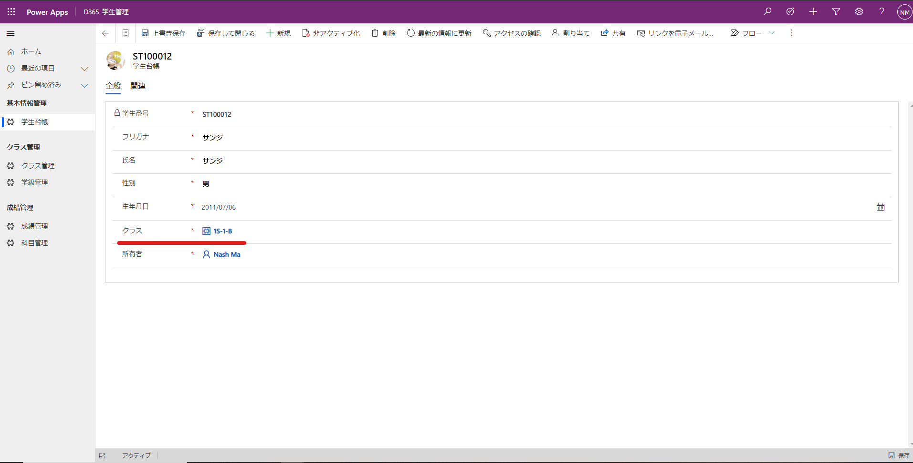
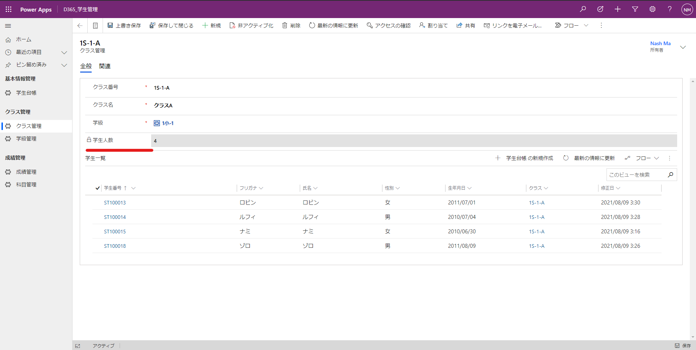

# テーブル：学生台帳（new_tbl_student）
| 表示名 | 名前 | データタイプ | 必須 | 備考1 | 備考2 |
|:---:|:---:|:---:|:---:|:---:|:---:|
|学生番号 |pas_student_no |一行テキスト |● |オートナンバー | | 
|クラス |pas_class |検索 |● |参照先：クラス管理 | | 

# テーブル：クラス管理（new_tbl_class）
| 表示名 | 名前 | データタイプ | 必須 | 備考1 | 備考2 |
|:---:|:---:|:---:|:---:|:---:|:---:|
|クラス番号 |pas_class_no |一行テキスト |● | | | 
|学生人数 |pas_student_number |整数 | |範囲：0～25 | | 

# ■プラグイン登録内容

## アセンブリの登録
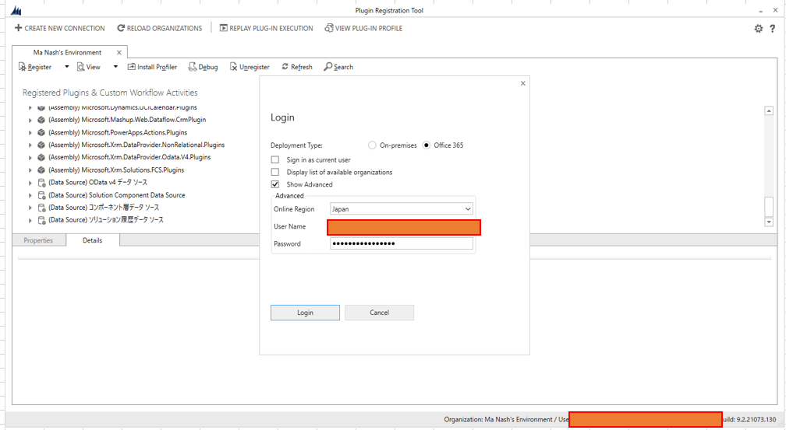
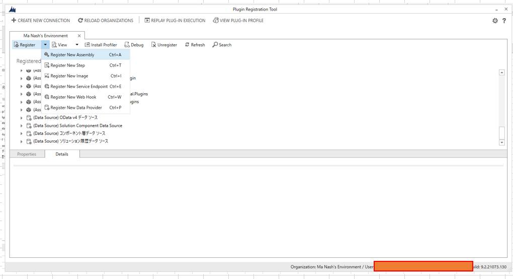
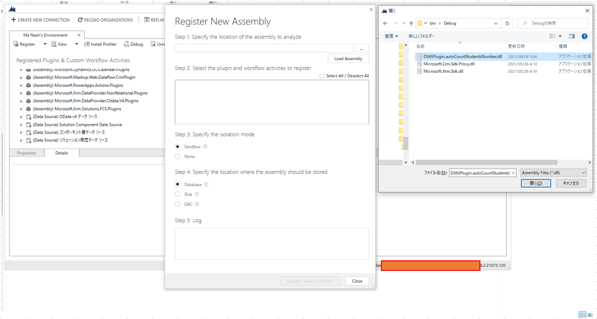
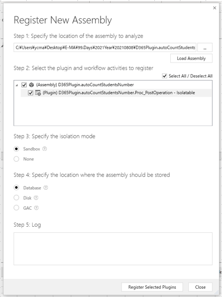
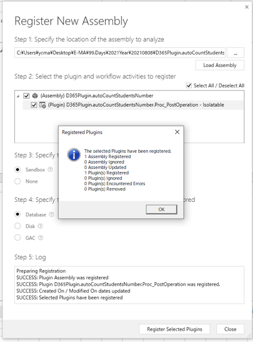

## ステップ：作成（Create）
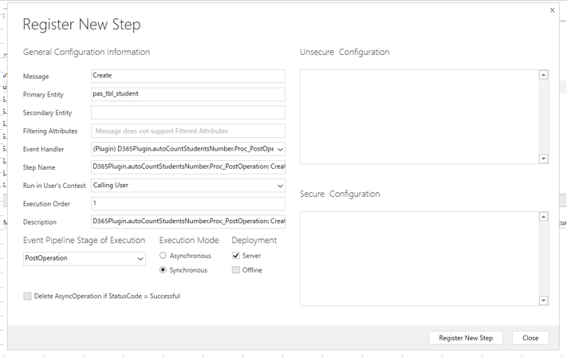

## ステップ：更新（Update）
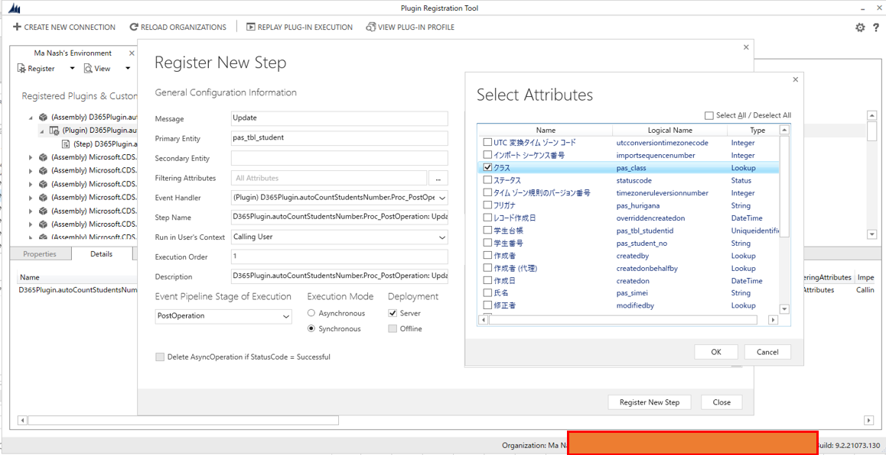
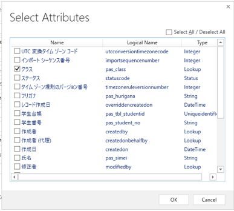
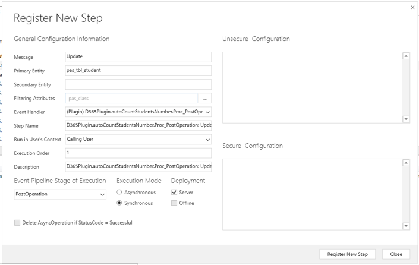

## プレイメージ
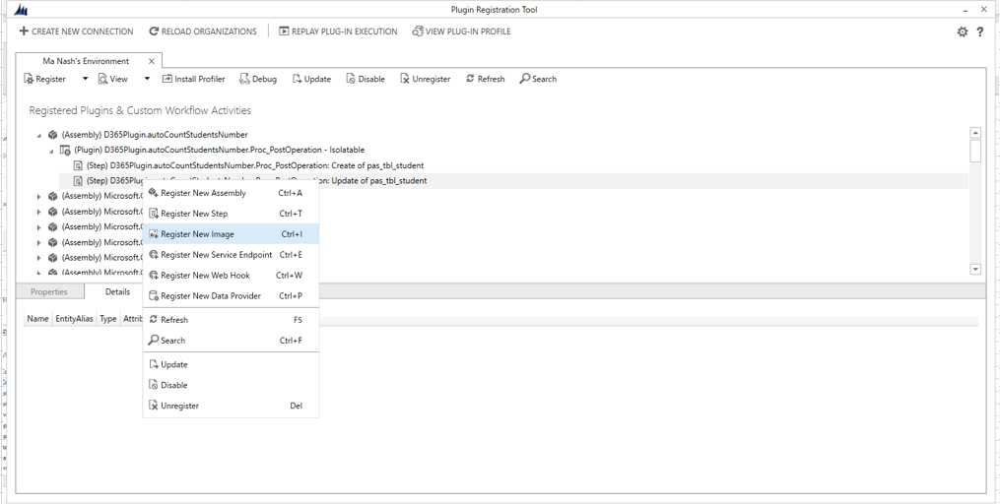
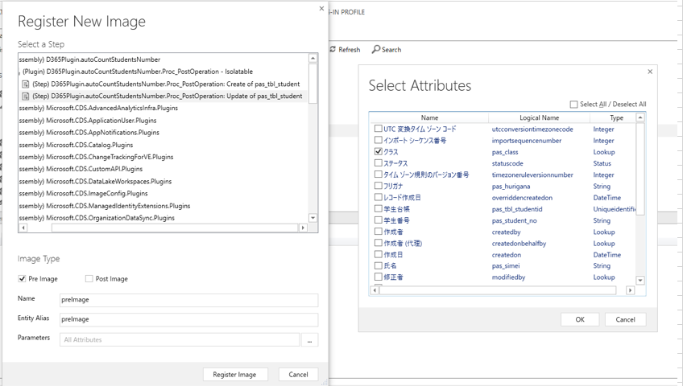
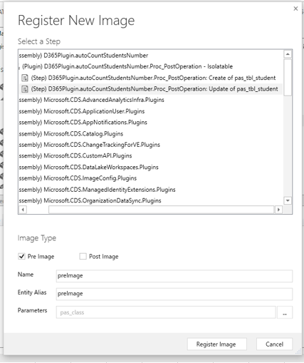

# 登録済の状態
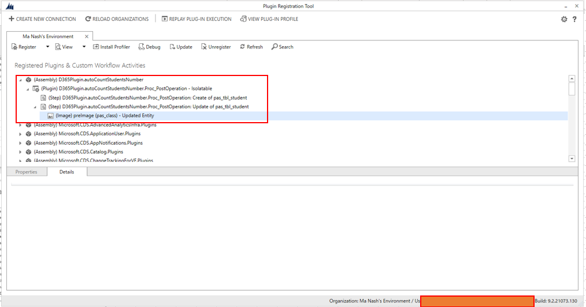

